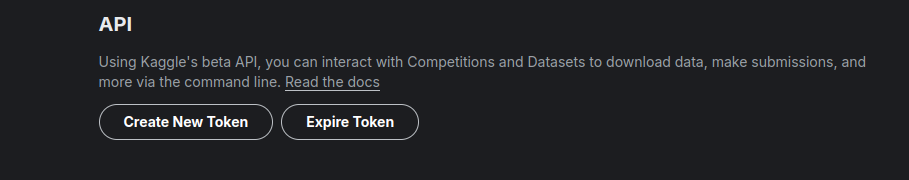
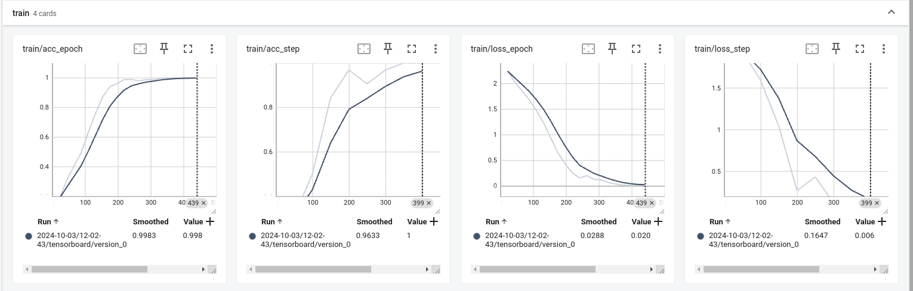
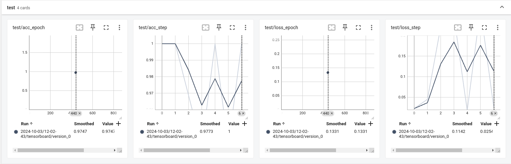
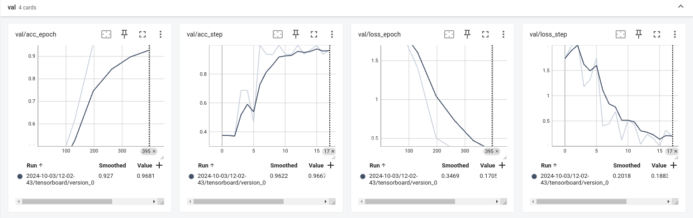
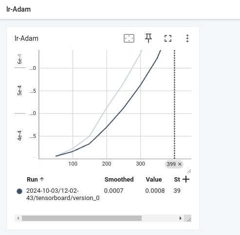

# Dosg Bread Classifier   
[](https://github.com/Muthukamalan/lightning-hydra/actions/workflows/ci.yml)

# TODO:
- [X] ~pyproject.toml~ requirements.txt
- [X] Dockerfile
- [X] .devcontainer
- [X] pytest 
- [X] codecov  
- [X] Docker Image to GHCR
- [ ] fail if accuracy<.95 
- [X] store artifact
- [X] added dvc
- [X] sample inference
- [X] added vit model
- [X] comet logs
- [ ] badge

### [Dogs Dataset](https://www.kaggle.com/datasets/khushikhushikhushi/dog-breed-image-dataset)
In Order to run program successfully, modification `.env` file
###### step 1: download API key from kaggle

- create new key
- paste it on `.env`file

###### step 2: modify .env file
```
username=
key=
```


### Project Folder Structure
```sh.
$ tree --dirsfirst -L 2 -a -I .git .
├── configs
│   ├── callbacks
│   ├── data
│   ├── experiment
│   ├── hydra
│   ├── logger
│   ├── model
│   ├── paths
│   ├── trainer
│   ├── train_old.yaml
│   └── train.yaml
├── data
├── Dockerfile
├── .gitignore
├── .python-version
├── .env
├── pyproject.toml
├── README.md
├── src
│   ├── datamodules
│   ├── infer.py
│   ├── models
│   ├── train.py
│   └── utils
└── tests
    ├── conftest.py
    ├── datamodules
    ├── models
    └── test_train.py

```

# Training, Testing
```sh
python src/train.py data.batch_size:64 model.pretrained=false trainer.max_epochs=10
```
## confusion matrix
- Train

    .png)

- Test

    .png)


# Inference
```sh 
python src/inference.py --ckpt_path=/path/model.ckpt --input_folder=/home/path_folder --output_folder=/home/path_folder
```

# pytest
- generate xml report for code coverage
```sh
coverage run -m pytest
coverage xml -o coverage.xml
pytest --cov --cov-report=xml
```


# Tensorboard logs
```sh
tensorboard --logdir outputs/ --load_fast=false 
```


# Reports
- 
- 
- 
- 


## Sample Results
```sh
python src/inference.py --ckpt_path=outputs/2024-10-17/21-01-46/checkpoints/epoch_002.ckpt --input_folder=samples/input/ --output_folder=samples/output/ s
```


## comet summary
```sh
COMET INFO: ---------------------------------------------------------------------------------------
COMET INFO: Comet.ml ExistingExperiment Summary
COMET INFO: ---------------------------------------------------------------------------------------
COMET INFO:   Data:
COMET INFO:     display_summary_level : 1
COMET INFO:     name                  : spontaneous_fixture_5578
COMET INFO:     url                   : https://www.comet.com/muthukamalan/general/36c132d1d61d46a4a31191470c34b444
COMET INFO:   Metrics [count] (min, max):
COMET INFO:     test/acc_epoch     : 0.9595959782600403
COMET INFO:     test/acc_step [7]  : (0.84375, 1.0)
COMET INFO:     test/loss_epoch    : 0.17024929821491241
COMET INFO:     test/loss_step [7] : (0.030070079490542412, 0.523006796836853)
COMET INFO:   Others:
COMET INFO:     Created from : pytorch-lightning
COMET INFO:   Parameters:
COMET INFO:     batch_size         : 32
COMET INFO:     data_dir           : /workspaces/lightning-hydra/data//dogs_dataset
COMET INFO:     lr                 : 0.001
COMET INFO:     min_lr             : 1e-06
COMET INFO:     model_name         : vit_tiny_patch16_224
COMET INFO:     num_classes        : 10
COMET INFO:     num_workers        : 0
COMET INFO:     pin_memory         : True
COMET INFO:     pretrained         : True
COMET INFO:     scheduler_factor   : 0.1
COMET INFO:     scheduler_patience : 10
COMET INFO:     trainable          : False
COMET INFO:     weight_decay       : 1e-05
COMET INFO:   Uploads:
COMET INFO:     model graph : 1
COMET INFO: 
COMET WARNING: To get all data logged automatically, import comet_ml before the following modules: torch.
COMET INFO: Uploading 1 metrics, params and output messages
[2024-10-17 21:03:17,973][__main__][INFO] - Test metrics:
[{'test/loss_epoch': 0.17024929821491241, 'test/acc_epoch': 0.9595959782600403}]
```